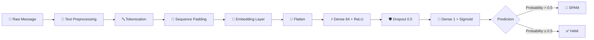
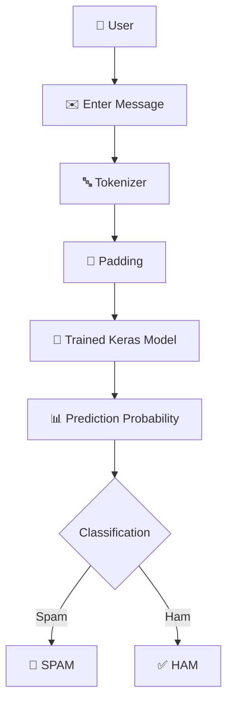
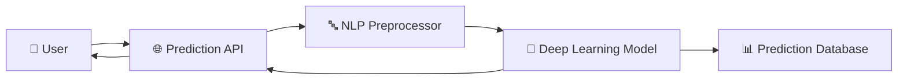

# ✉️ Deep Learning Spam Email Classifier

<p align="center">

  
  
  
  
  

</p>

<h3 align="center">
  🛡️ Intelligent Email & Message Filtering with Deep Learning
</h3>

<p align="center">
  A neural-network based NLP system that analyzes text messages and classifies them as 
  <strong>SPAM</strong> or <strong>HAM</strong> (legitimate).
</p>

---

## 🚀 Project Overview

Spam messages are one of the most common forms of unwanted digital communication. Traditional keyword-based filters can struggle when spam messages use unusual wording, disguised keywords, or changing patterns.

This project uses **Natural Language Processing (NLP)** and a **Deep Learning neural network** to learn patterns from labeled messages and classify new text as:

> 🚨 **SPAM** — potentially unwanted or malicious message
> ✅ **HAM** — legitimate / non-spam message

The trained model is also integrated into a **Streamlit web application**, allowing users to enter a message and receive a classification result with a probability score.

---

## 🧠 How It Works



### The pipeline

**Message → Tokenization → Padding → Embedding → Neural Network → Probability → Classification**

---

# 🏗️ Model Architecture

The project uses a lightweight feed-forward deep learning architecture designed for binary text classification.

```text
                    INPUT MESSAGE
                         │
                         ▼
              ┌─────────────────────┐
              │     Tokenizer       │
              │ Vocabulary = 10,000 │
              └──────────┬──────────┘
                         │
                         ▼
              ┌─────────────────────┐
              │  Sequence Padding   │
              └──────────┬──────────┘
                         │
                         ▼
              ┌─────────────────────┐
              │     Embedding       │
              │   Dimension = 100   │
              └──────────┬──────────┘
                         │
                         ▼
              ┌─────────────────────┐
              │       Flatten       │
              └──────────┬──────────┘
                         │
                         ▼
              ┌─────────────────────┐
              │ Dense Layer         │
              │ 64 neurons / ReLU   │
              └──────────┬──────────┘
                         │
                         ▼
              ┌─────────────────────┐
              │ Dropout             │
              │ Rate = 0.5          │
              └──────────┬──────────┘
                         │
                         ▼
              ┌─────────────────────┐
              │ Output Layer        │
              │ 1 neuron / Sigmoid  │
              └──────────┬──────────┘
                         │
                         ▼
                 🚨 SPAM / ✅ HAM
```

### Architecture Summary

| Component           | Configuration         |
| ------------------- | --------------------- |
| Input               | Padded token sequence |
| Vocabulary Size     | `10,000`              |
| Embedding Dimension | `100`                 |
| Flatten             | Yes                   |
| Dense Layer         | `64 neurons`          |
| Activation          | `ReLU`                |
| Dropout             | `0.5`                 |
| Output              | `1 neuron`            |
| Output Activation   | `Sigmoid`             |
| Optimizer           | `Adam`                |
| Loss Function       | `Binary Crossentropy` |
| Batch Size          | `32`                  |
| Epochs              | `10`                  |

---

# 📊 Data Processing Pipeline

The notebook performs the following preprocessing workflow:

### 1️⃣ Label Encoding

The original categories:

```text
ham  →  numerical label
spam →  numerical label
```

are converted into numerical values using `LabelEncoder`.

### 2️⃣ Tokenization

Text is converted into integer sequences using the Keras tokenizer.

```python
Tokenizer(
    num_words=10000,
    oov_token="<unk>"
)
```

Unknown words are represented using the `<unk>` token.

### 3️⃣ Sequence Padding

Messages naturally have different lengths.

Padding converts them into a consistent shape:

```text
Message A → [12, 45, 78]
Message B → [21, 7, 93, 14, 62]
                     ↓
             Padded Sequences
```

### 4️⃣ Train/Test Split

The processed dataset is divided into:

```text
              Dataset
                 │
        ┌────────┴────────┐
        ▼                 ▼
    Training            Testing
      80%                 20%
        │
        ▼
 Validation Split
      10%
```

The split uses `stratify=y` to preserve the class distribution.

---

# 🧪 Model Training

The model is compiled using:

```python
model.compile(
    optimizer="adam",
    loss="binary_crossentropy",
    metrics=["accuracy"]
)
```

Training configuration:

```python
BATCH_SIZE = 32
EPOCHS = 10
```

During training, the model tracks:

* Training Accuracy
* Validation Accuracy
* Training Loss
* Validation Loss

---

# 📈 Model Evaluation

The notebook evaluates the classifier using:

### Accuracy

Measures the overall percentage of correctly classified messages.

### Precision

Measures how many messages predicted as spam were actually spam.

### Recall

Measures how many actual spam messages were successfully detected.

### F1-Score

Provides a balance between precision and recall.

### Confusion Matrix

The project also generates a confusion matrix to visualize:

```text
                     PREDICTED
                 HAM          SPAM
              ┌──────────┬──────────┐
ACTUAL   HAM  │    TN    │    FP    │
              ├──────────┼──────────┤
         SPAM │    FN    │    TP    │
              └──────────┴──────────┘
```

This is especially important for spam detection because false positives can cause legitimate messages to be incorrectly classified as spam.

> **Note:** The notebook contains evaluation code, but the saved notebook content does not include the resulting metric values. Therefore, this README does not claim a specific accuracy, precision, recall, or F1-score.

---

# 🖥️ Streamlit Application

The trained model is deployed through a Streamlit interface.



The application provides:

* ✉️ Message input
* ⚡ One-click classification
* 🚨 Spam warning
* ✅ Ham confirmation
* 📊 Prediction probability
* 📋 Original message display
* ℹ️ Model information sidebar

---

# 💾 Saved Model Components

The notebook saves the following deployment artifacts:

```text
streamlit_model_components/
│
├── 🧠 spam_classifier_model.keras
├── 🔤 tokenizer.pkl
├── 🏷️ label_encoder.pkl
└── ⚙️ model_params.pkl
```

### Why save these separately?

The model alone is not enough for deployment.

The application must reproduce the exact preprocessing pipeline used during training.

Therefore:

```text
Raw Text
   ↓
Tokenizer
   ↓
Padding Parameters
   ↓
Neural Network
   ↓
Label Encoder
   ↓
Final Prediction
```

---

# 🛠️ Tech Stack

| Technology            | Purpose                          |
| --------------------- | -------------------------------- |
| 🐍 Python             | Core programming language        |
| 🧠 TensorFlow / Keras | Deep Learning                    |
| 🔤 NLP                | Text processing                  |
| 🐼 Pandas             | Data manipulation                |
| 🔢 NumPy              | Numerical operations             |
| 📊 Scikit-learn       | Encoding, splitting & evaluation |
| 📈 Matplotlib         | Visualization                    |
| 🎨 Seaborn            | Confusion matrix visualization   |
| 🖥️ Streamlit         | Web application                  |
| 📦 Pickle             | Saving preprocessing components  |
| ☁️ Kaggle             | Dataset source                   |

---

# 📁 Recommended Repository Structure

```text
spam-email-classifier/
│
├── 📓 Spam_Email.ipynb
│
├── 🖥️ streamlit_app.py
│
├── 🧠 streamlit_model_components/
│   ├── spam_classifier_model.keras
│   ├── tokenizer.pkl
│   ├── label_encoder.pkl
│   └── model_params.pkl
│
├── 📊 README.md
│
├── 📦 requirements.txt
│
└── 📄 .gitignore
```

---

# ⚙️ Installation

Clone the repository:

```bash
git clone https://github.com/YOUR_USERNAME/spam-email-classifier.git
cd spam-email-classifier
```

Create a virtual environment:

```bash
python -m venv venv
```

Activate it.

### Windows

```bash
venv\Scripts\activate
```

### Linux / macOS

```bash
source venv/bin/activate
```

Install dependencies:

```bash
pip install tensorflow pandas numpy scikit-learn matplotlib seaborn streamlit
```

---

# ▶️ Run the Application

After the model components have been generated:

```bash
streamlit run streamlit_app.py
```

The application will open in your browser.

---

# 🧪 Example Predictions

### Example 1 — Spam

```text
Congratulations! You have won a cash prize.
Click the link below to claim your reward now!
```

Expected:

```text
🚨 SPAM
```

### Example 2 — Ham

```text
Hey, are you coming to college tomorrow?
```

Expected:

```text
✅ HAM
```

> These are illustrative examples for demonstrating the application interface; they are not recorded prediction outputs from the notebook.

---

# 🔐 Security & Privacy Considerations

This project is intended as an educational machine-learning application.

For production deployment, consider adding:

* Input sanitization
* Rate limiting
* Secure model serving
* Logging and monitoring
* Adversarial/spam-pattern testing
* Model versioning
* Data privacy controls
* Threshold optimization
* Robust handling of malicious or extremely long inputs

---

# ⚠️ Limitations

The current implementation is intentionally lightweight.

### Current limitations include:

* The model uses `Embedding + Flatten` rather than an LSTM/GRU/Transformer architecture.
* The dataset may contain class imbalance.
* A fixed prediction threshold of `0.5` is used.
* Model performance depends heavily on the training dataset.
* Real-world spam evolves continuously.
* The model should not be considered a complete enterprise-grade email security solution.

---

# 🚀 Future Improvements

The project can be upgraded into a significantly more powerful NLP system.

### 🔥 Model Improvements

* LSTM
* BiLSTM
* GRU
* 1D CNN
* Attention mechanisms
* BERT / DistilBERT
* Transformer-based classifiers

### 📊 Data Improvements

* Larger spam datasets
* Multilingual spam detection
* Class balancing
* Data augmentation
* URL and attachment features
* Sender/domain features

### 🧠 Explainable AI

Add:

```text
Prediction
    ↓
Important words/features
    ↓
Why was this classified as spam?
```

This would make the model more interpretable.

### 🌐 Production Deployment

Potential architecture:



Possible next-stage technologies:

* FastAPI
* Docker
* PostgreSQL
* Redis
* AWS / Azure / GCP
* CI/CD
* Model monitoring

---

# 🎯 Project Goals

```text
                SPAM DETECTION SYSTEM
                         │
        ┌────────────────┼────────────────┐
        ▼                ▼                ▼
     Accuracy          Speed          Usability
        │                │                │
        ▼                ▼                ▼
     Better NLP      Lightweight      Streamlit
        │                │                │
        └────────────────┼────────────────┘
                         ▼
                🛡️ Safer Messaging
```

---

# 👨‍💻 Author

**Aravind**

AI & Data Science Student
Interested in **Artificial Intelligence • Machine Learning • Deep Learning • Data Science**

---

# ⭐ Support

If you found this project useful:

⭐ Star the repository
🍴 Fork the project
🐛 Report issues
💡 Suggest improvements
🤝 Contribute to the project

---

<p align="center">

### 🧠 Turning Text Into Intelligence

**Built with Python • TensorFlow • NLP • Streamlit**

</p>

<p align="center">
  <strong>🚨 Detect Spam. Understand Text. Build Smarter Systems. 🚀</strong>
</p>
